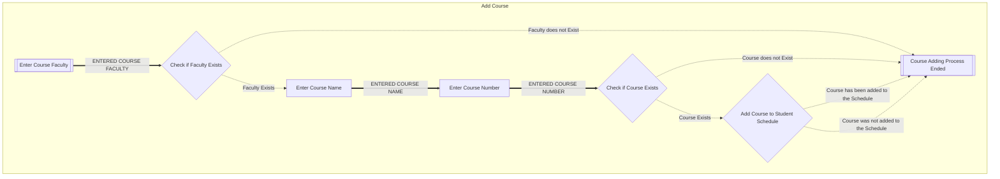
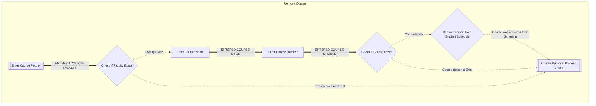
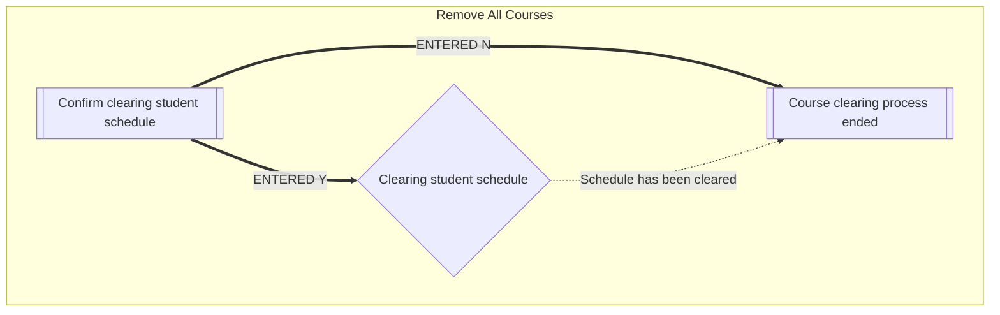
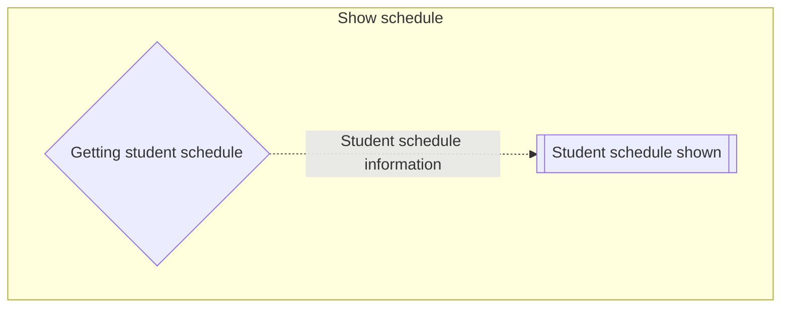
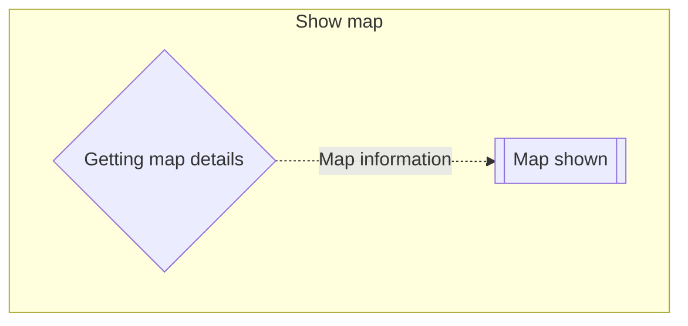
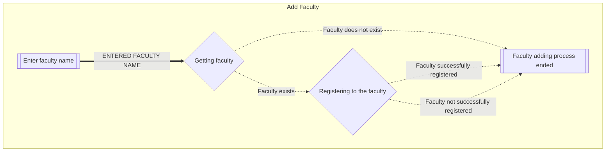
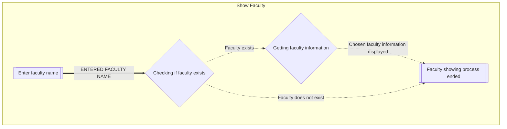
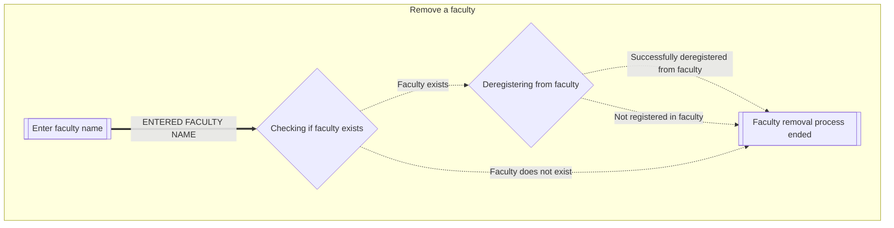

# Flows of interaction

## Diagrams

### Add Course

```mermaid
flowchart
    subgraph "Add Course"
        faculty[[Enter Course Faculty]]
        getFaculty{Check if Faculty Exists}
        courseName[Enter Course Name]
        courseNum[Enter Course Number]
        getCourse{Check if Course Exists}
        addCourse{Add Course to Student Schedule}
        added[[Course Adding Process Ended]]


        faculty ==ENTERED COURSE FACULTY==> getFaculty
        courseName ==ENTERED COURSE NAME==> courseNum
        courseNum ==ENTERED COURSE NUMBER==> getCourse

        getFaculty -.Faculty Exists.-> courseName
        getFaculty -.Faculty does not Exist .-> added
        getCourse -.Course Exists.-> addCourse
        getCourse -.Course does not Exist.-> added
        addCourse -.Course has been added to the Schedule.-> added
        addCourse -.Course was not added to the Schedule.-> added

    end

```

### Remove Course

```mermaid
flowchart
    subgraph "Remove Course"
        faculty[[Enter Course Faculty]]
        getFaculty{Check if Faculty Exists}
        courseName[Enter Course Name]
        courseNum[Enter Course Number]
        getCourse{Check if Course Exists}
        removeCourse{Remove course from Student Schedule}
        removed[[Course Removal Process Ended]]

        faculty ==ENTERED COURSE FACULTY==> getFaculty
        courseName ==ENTERED COURSE NAME==> courseNum
        courseNum ==ENTERED COURSE NUMBER==> getCourse

        getFaculty -.Faculty Exists.-> courseName
        getCourse -.Course Exists.-> removeCourse
        getCourse -.Course does not Exist.-> removed
        getFaculty -.Faculty does not Exist.-> removed
        removeCourse -.Course was removed from Schedule.-> removed

    end

```

### Remove All Course

```mermaid
flowchart
    subgraph "Remove All Courses"
        confirm[[Confirm clearing student schedule]]
        clearSchedule{Clearing student schedule}
        cleared[[Course clearing process ended]]

        confirm ==ENTERED Y==> clearSchedule
        confirm ==ENTERED N==> cleared

        clearSchedule -.Schedule has been cleared.-> cleared

    end
```

### Show Schedule

```mermaid
flowchart
    subgraph "Show schedule"
        displaySchedule{Getting student schedule}
        displayed[[Student schedule shown]]

        displaySchedule -.Student schedule information.-> displayed

    end

```

### Show Map

```mermaid
flowchart
    subgraph "Show map"
        displayMap{Getting map details}
        displayed[[Map shown]]

        displayMap -.Map information.-> displayed

    end

```

### Add Faculty

```mermaid
flowchart
    subgraph "Add Faculty"
        faculty[[Enter faculty name]]
        getFaculty{Getting faculty}
        addFaculty{Registering to the faculty}
        added[[Faculty adding process ended]]

        faculty ==ENTERED FACULTY NAME==> getFaculty

        getFaculty -.Faculty exists.-> addFaculty
        getFaculty -.Faculty does not exist.-> added
        addFaculty -.Faculty successfully registered.-> added
        addFaculty -.Faculty not successfully registered.-> added

    end

```

### Show Faculty

```mermaid
flowchart
    subgraph "Show Faculty"
        faculty[[Enter faculty name]]
        getFaculty{Checking if faculty exists}
        facultyInformation{Getting faculty information}
        showed[[Faculty showing process ended]]


        faculty ==ENTERED FACULTY NAME==> getFaculty

        getFaculty-.Faculty exists.->facultyInformation
        facultyInformation-.Chosen faculty information displayed.->showed
        getFaculty-.Faculty does not exist.-> showed

    end

```

### Remove A Faculty

```mermaid
flowchart
    subgraph "Remove a faculty"
        faculty[[Enter faculty name]]
        getFaculty{Checking if faculty exists}
        removeFaculty{Deregistering from faculty}
        removed[[Faculty removal process ended]]

        faculty ==ENTERED FACULTY NAME==> getFaculty

        getFaculty-.Faculty exists.->removeFaculty
        removeFaculty-.Successfully deregistered from faculty.->removed
        removeFaculty-.Not registered in faculty.->removed
        getFaculty-.Faculty does not exist.-> removed

    end

```