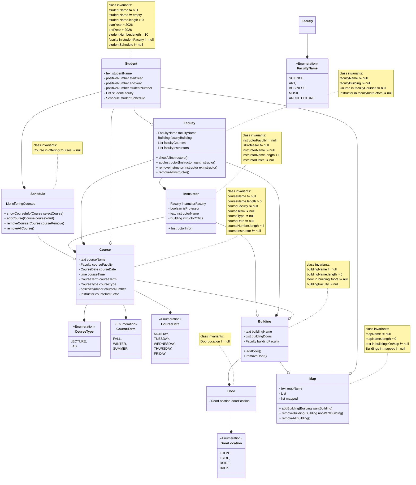

# Domain model

## Resources

## Diagram

Here is the diagram for my domain model

```mermaid
classDiagram
    class Student{
        - text studentName
        - positiveNumber startYear 
        - positiveNumber endYear
        - positiveNumber studentNumber
        - List<Faculty> studentFaculty
        - Schedule studentSchedule
    }
    note for Student "class invariants:
        studentName != null
        studentName != empty
        studentName.length > 0
        startYear > 2026
        endYear > 2026
        studentNumber.length = 10
        faculty in studentFaculty != null
        studentSchedule != null
    "

    class Course{
        - text courseName
        - Faculty courseFaculty
        - CourseDate courseDate
        - time courseTime
        - CourseTerm courseTerm
        - CourseType courseType
        - positiveNumber courseNumber
        - Instructor courseInstructor
    }
    note for Course "class invariants:
        courseName != null
        courseName.length > 0
        courseFaculty != null
        courseTerm != null
        courseType != null
        courseDate != null
        courseNumber.length = 4
        courseInstructor != null
    "
    class CourseType<<Enumeration>>{
        LECTURE,
        LAB
    }
    class CourseTerm<<Enumeration>>{
        FALL,
        WINTER,
        SUMMER
    }
    class CourseDate<<Enumeration>>{
        MONDAY,
        TUESDAY,
        WEDNESDAY,
        THURSDAY,
        FRIDAY
    }
    

    class Faculty{
        - FacultyName facultyName
        - Building facultyBuilding
        - List<Course> facultyCourses
        - List<Instructor> facultyInstructors
        + showAllInstructors()
        + addInstructor(Instructor wantInstructor)
        + removeInstructor(Instructor exInstructor)
        + removeAllInstructor()
    }
    note for Faculty "class invariants:
        facultyName != null
        facultyBuilding != null
        Course in facultyCourses != null
        Instructor in facultyInstructors != null
    "
    class FacultyName<<Enumeration>>{
        SCIENCE,
        ART,
        BUSINESS,
        MUSIC,
        ARCHITECTURE
    }  

    
    class Instructor{
        - Faculty instructorFaculty
        - boolean isProfessor
        - text instructorName
        - Building intructorOffice
        + InstructorInfo()
    }
    note for Instructor "class invariants:
        instructorFaculty != null
        isProfessor != null
        instructorName != null
        instructorName.length > 0
        instructorOffice != null
    "

    class Building{
        - text buildingName
        - List<Door> buildingDoors
        - Faculty buildingFaculty
        + addDoor()
        + removeDoor()
    }
    note for Building "class invariants:
        buildingName != null
        buildingName.length > 0
        Door in buildingDoors != null
        buildingFaculty != null
    "
    
    class Door{
        - DoorLocation doorPosition
    }
    note for Door "class invariants:
        DoorLocation != null
    "
    class DoorLocation<<Enumeration>>{
        FRONT,
        LSIDE,
        RSIDE,
        BACK
    }  

    class Map{
        - text mapName
        - List<text> buildingsOnMap
        - list<Building> mapped
        + addBuilding(Building wantBuilding)
        + removeBuilding(Building notWantBuilding)
        + removeAllBuilding()
    }
    note for Map "class invariants:
        mapName != null
        mapName.length > 0
        text in buildingsOnMap != null
        Buildings in mapped != null
    "

    class Schedule{
        - List<Course> offeringCourses
        + showCourseInfo(Course selectCourse)
        + addCourse(Course courseWant)
        + removeCourse(Course courseRemove)
        + removeAllCourse()
    }
    note for Schedule "class invariants:
        Course in offeringCourses != null
    "


    %%Relationships
    Student --o Course
    Student --o Faculty
    Student --o Map
    Student --* Schedule
    Faculty --* Course
    Course --o Building
    Faculty --* Instructor
    Faculty --* Building
    Instructor --* Course
    Instructor --o Building
    Building --* Door
    Building --o Map
    Schedule --o Course
    
    Course --* CourseType
    Course --* CourseTerm
    Course --* CourseDate
    Door --* DoorLocation
    Facutly --* FacultyName
    
   
```